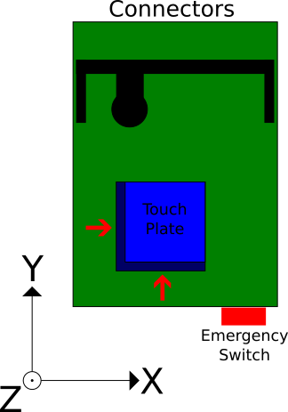

# Stepcraft-GRBL-Estlcam <!-- omit in toc -->

Configuration of Stepcraft CNC Mill (D-Series 1) for GRBL and Estlcam

- [Introduction](#introduction)
- [System configuration](#system-configuration)
- [Geometry](#geometry)
- [Pin connections](#pin-connections)
  - [Limit switch wiring](#limit-switch-wiring)
  - [Probe](#probe)
- [Stepper settings](#stepper-settings)
- [Sample configuration for Estlcam 11](#sample-configuration-for-estlcam-11)
- [References](#references)

# Introduction

Some years ago i bought a [Stepcraft](https://www.stepcraft-systems.com) D 600 with LPT module that i was using initially together with Linux CNC. Meanwhile i switched to GRBL (because of much less space needed for controlling the machine). I rewired the LPT port, ripped out the electronic components from the milling machine and put everything together into a small electronics cabinet. 

I tried several opensource CNC software solutions but i wasn't that much satisfied because they offered way too much features with a lot of configuration efford needed. [Estlcam](https://www.estlcam.de/) came across and so i started using this. It offers a lot of nicely usable features for a very low price. Also touchplates and other hardware (like XBox controllers) is supported. And best of all, it's made by someone who's using it by himself and knows a lot of tricks that are valuable for milling. Having a look at the site is always worth doing to get some good ideas how to improve your hardware and ways of working.

This repository should give some hints (and helps me to memorize the settings) how to setup Estlcam for GRBL and Stepcraft CNC machines. 

**Warning: I'm not responsible for any damages or harms that arise from using this tutorial!**

# System configuration

| Component | Version |
| --------- | ------- |
| Stepcraft CNC Milling machine | D 600 (Series 1) |
| Arduino Nano | n/a |
| Estlcam | 11 |
| Tool length probe | Stepcraft Tool Probe (35mm) |
| Touch plate | self made |

# Geometry

Below you see some schematic drawing of the machine coordinate system.

# Pin connections

The following table describes the pin connections from the LPT port to an Arduino.

| Description       | Arduino Pin  | LPT Pin   | Estlcam Naming | Inverted            |
| ----------------- | ------------ | --------- | -------------- | ------------------- |
|  Step X           |      D2      |   3       |                |                     |
|  Step Y           |      D3      |   5       |                |                     |
|  Step Z           |      D4      |   7       |                |                     |
|  Dir X            |      D5      |   2       |                |                     |
|  Dir Y            |      D6      |   4       |                |                     |
|  Dir Z            |      D7      |   6       |                |                     |
| Limit X/Y/Z       |      D9      |   12      |    Input 1     |   yes               |
|  Emergency Switch |      A0      |   11      |    Input 5     |   yes               |
|  Probe            |      A5      |   10      |    Input 8     |    no (see below)   |
|  GND              |      GND     |   18 - 25 |                |                     |

## Limit switch wiring

The Stepcraft CNC machine has only one output for the end switch signal. Estlcam is configuring GRBL to do a separate homing for each axis. So this shouldn't be a problem.  

## Probe

I'm currently using the Stepcraft probe sensor together with a touch plate. The default probe sensor interrupts the circuit and signalizes that it was triggered. I rewired it so it is closing the circuit to have the same behavior as the touch plate. That's the reason why i don't invert the probe pin in Estlcam.

When using the height probe sensor or touch plate, don't forget to configure the settings in Estlcam accordingly!

# Stepper settings

| Axis | Steps per revolution | Distance per revolution | Feed        | Direction inverted |
| ---- | -------------------- | ----------------------- | ----------- | ------------------ |
|  X   |         400          |         3 mm            | 1500 mm/min | no                 |
|  Y   |         400          |         3 mm            | 1500 mm/min | no                 |
|  Z   |         400          |         3 mm            | 1500 mm/min | no                 |

 See [Stepcraft Machine Parameters](https://www.stepcraft-systems.com/images/SC-Service/Anleitungen-EN/SC_Machine_parameters_D-Series_EN.pdf) for details.

# Sample configuration for Estlcam 11

See the sample configuration [file](estlcam_sample_config.txt) within this repository. 
Check that the values are according to your settings before using it.

# References

- [Stepcraft manual D-Series 1](https://www.stepcraft-systems.com/images/SC-Service/Anleitungen-EN/Betriebsanleitung-v5-eng.pdf)
- [Stepcraft Machine Parameters](https://www.stepcraft-systems.com/images/SC-Service/Anleitungen-EN/SC_Machine_parameters_D-Series_EN.pdf)